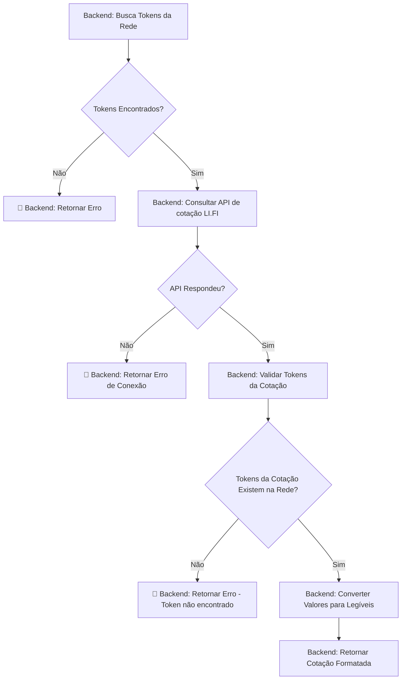
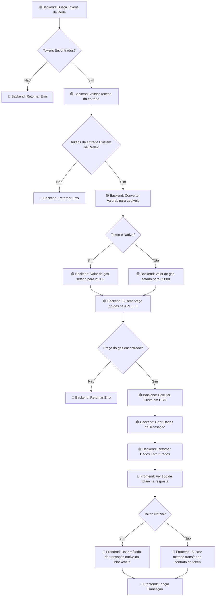
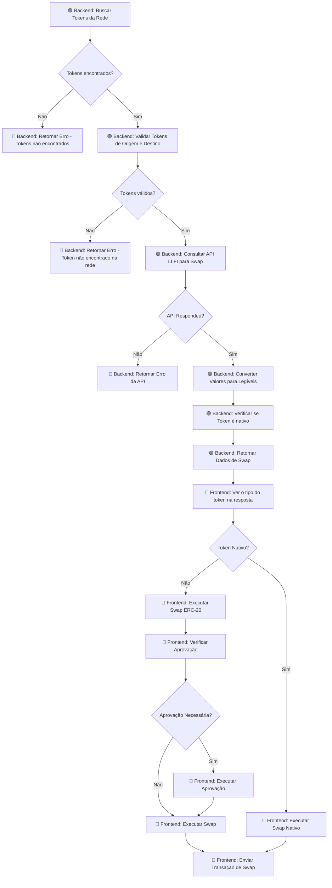

# Documentação Técnica: Fluxos Completos dos Agentes Blockchain

## Resumo

Este documento apresenta os fluxos completos dos três agentes principais do sistema: **Quote Agent**, **Transfer Agent** e **Swap Agent**. Cada diagrama mostra o fluxo completo desde a requisição até a execução da transação, incluindo tanto o backend quanto o frontend.

## 1. Fluxo Completo: Quote Agent (Cotação)

### 1.1 Visão Geral

O Quote Agent processa requisições de cotação, consulta APIs externas e retorna informações formatadas para o usuário.

### 1.2 Fluxo Completo Backend + Frontend



### 1.3 Lógica Implementada

```python
# Backend: Processamento da cotação
await fetch_and_store_tokens(chain)
quote = await self.lifi_service.get_quote(user_request, extracted_data)
quote = convert_quote_to_human_readable(quote, from_token_decimals, to_token_decimals)
quote = filter_quote_fields(quote)
```

## 2. Fluxo Completo: Transfer Agent (Transferência)

### 2.1 Visão Geral

O Transfer Agent gerencia transferências de tokens entre endereços, calcula gas e prepara dados para execução no frontend.

### 2.2 Fluxo Completo Backend + Frontend



### 2.3 Lógica de Gas por Rede (passível de refatoração com cálculo)

```python
# Backend: Gás fixo por tipo de token (estimativa)
base_gas = {"ETH": 21000, "BAS": 21000, "POL": 21000}
erc20_gas = {"ETH": 65000, "BAS": 65000, "POL": 65000}

if is_native:
    gas_value = base_gas.get(chain_upper, 21000)
else:
    gas_value = erc20_gas.get(chain_upper, 65000)
```

### 2.4 Execução Frontend

```typescript
// Frontend: Execução de transação ERC-20
private static async executeERC20TransferTransaction(
    transactionData: TransactionData,
    signer: ethers.Signer,
    tokenContractAddress: string
): Promise<string> {
    const { recipient, amount } = this.validateTransferData(transactionData)
    const tokenContract = this.createTokenContract(tokenContractAddress, signer)

    const tx = await tokenContract.transfer(recipient, amount, {
        gasLimit: ethers.getBigInt(transactionData.transactionRequest.gasLimit),
        gasPrice: ethers.getBigInt(transactionData.transactionRequest.gasPrice),
    })

    return tx.hash
}
```

## 3. Fluxo Completo: Swap Agent (Troca)

### 3.1 Visão Geral

O Swap Agent executa operações de troca entre tokens, implementa sistema de aprovação e gerencia execução no frontend.

### 3.2 Fluxo Completo Backend + Frontend



### 3.3 Lógica de Verificação de Token Nativo

```python
# Backend: Verificação de token nativo
def is_native_token(token_symbol, chain):
    native_tokens = {
        "ETH": ["ETH"],
        "BAS": ["ETH"],
        "POL": ["MATIC"]
    }
    chain_upper = chain.upper()
    return token_symbol.upper() in native_tokens.get(chain_upper, [])

# Adiciona informações para aprovação
if 'transactionRequest' in swap_data:
    is_from_native = is_native_token(from_token, chain)
    swap_data['transactionRequest']['isNativeToken'] = is_from_native
    swap_data['transactionRequest']['fromTokenInfo'] = {
        "contract": from_token_info.get("address", ""),
        "decimals": from_token_info.get("decimals", 6),
        "name": from_token_info.get("name", from_token)
    }
```

### 3.4 Execução Frontend com Aprovação

```typescript
// Frontend: Execução de swap com aprovação
private static async executeERC20SwapTransaction(
    transactionData: TransactionData,
    provider: any,
    signer: ethers.Signer
): Promise<string> {
    const transaction = this.buildSwapTransaction(transactionData)

    // Verifica se aprovação é necessária
    if (transactionData.estimate.approvalAddress) {
        await this.approveTokenForSwap(transactionData, signer)
    }

    return await this.sendRawTransaction(provider, transaction)
}

// Sistema de aprovação
private static async approveTokenForSwap(
    transactionData: TransactionData,
    signer: ethers.Signer
): Promise<void> {
    const tokenContract = new ethers.Contract(
        transactionData.transactionRequest.fromTokenInfo?.contract as string,
        ERC20_ABI,
        signer
    )

    await tokenContract.approve(
        transactionData.estimate.approvalAddress,
        BigInt(transactionData.estimate.fromAmount),
        {
            gasLimit: transactionData.transactionRequest.gasLimit,
            gasPrice: transactionData.transactionRequest.gasPrice,
        }
    )
}
```

## 4. Resumo dos Fluxos

### 4.1 Padrão Comum dos Três Agentes

```
1. 🟢 Backend: Recebe requisição e valida dados
2. 🟢 Backend: Consulta APIs externas (LI.FI)
3. 🟢 Backend: Processa e estrutura dados
4. 🟢 Backend: Retorna dados estruturados
5. 🔵 Frontend: Recebe dados e detecta tipo
6. 🔵 Frontend: Troca para rede correta
7. 🔵 Frontend: Executa transação específica
8. 🔵 Frontend: Retorna confirmação ao usuário
```

### 4.2 Diferenças Principais

- **Quote Agent**: Apenas consulta e retorna informações (sem execução)
- **Transfer Agent**: Execução direta de transferência (nativa ou ERC-20)
- **Swap Agent**: Execução com sistema de aprovação automática

### 4.3 Pontos de Integração

- **Backend → Frontend**: Dados estruturados com `transactionRequest`
- **Frontend → Wallet**: Execução via Phantom Provider
- **Frontend → Blockchain**: Envio de transações assinadas

---

_Documento com fluxos completos Backend + Frontend - Versão 4.0_
